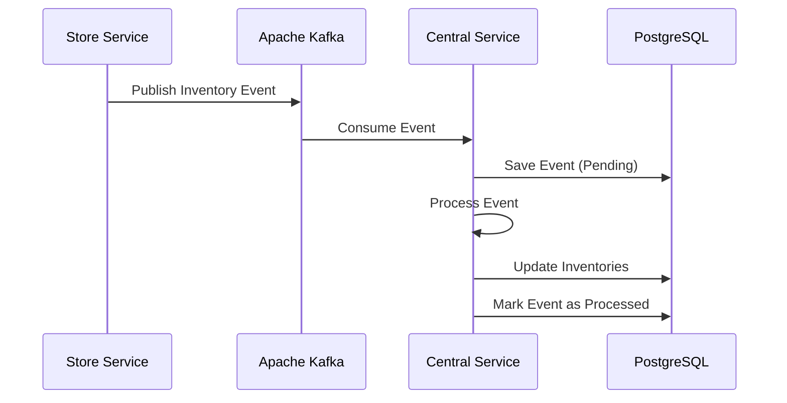

# Central Inventory Service

    

## 📋 Visão Geral

O **Central Inventory Service** é o núcleo centralizado do sistema de gestão de inventário, responsável por:

- 🏪 **Consolidação de Inventário**: Mantém visão unificada do inventário de todas as lojas
- 🔄 **Sincronização em Tempo Real**: Consome eventos Kafka das lojas para atualização instantânea
- 📊 **APIs Centralizadas**: Fornece endpoints para consulta consolidada de inventário
- 🎯 **Base de Dados Central**: Armazena dados agregados e histórico de eventos

## 🏗️ Arquitetura

O serviço foi construído seguindo os princípios da **Arquitetura Hexagonal** (Ports & Adapters):

```
┌─────────────────────────────────────────────────────────────────┐
│                        ADAPTERS (IN)                           │
├─────────────────────┬───────────────────────────────────────────┤
│   REST Controllers  │         Kafka Consumers                   │
│   - CentralInventory│         - InventoryEventConsumer          │
│   - EventAdmin      │                                           │
└─────────────────────┴───────────────────────────────────────────┘
┌─────────────────────────────────────────────────────────────────┐
│                      APPLICATION LAYER                         │
├─────────────────────────────────────────────────────────────────┤
│   Use Cases                                                     │
│   - GetCentralInventoryUseCase                                  │
│   - GetStoreInventoryUseCase                                    │
└─────────────────────────────────────────────────────────────────┘
┌─────────────────────────────────────────────────────────────────┐
│                       DOMAIN LAYER                              │
├─────────────────────────────────────────────────────────────────┤
│   Models              │   Services           │   Ports           │
│   - CentralInventory  │   - EventProcessing  │   - Repositories  │
│   - StoreInventory    │                      │                   │
│   - InventoryEvent    │                      │                   │
└─────────────────────────────────────────────────────────────────┘
┌─────────────────────────────────────────────────────────────────┐
│                       ADAPTERS (OUT)                            │
├─────────────────────────────────────────────────────────────────┤
│   JPA Repositories                                              │
│   - CentralInventoryRepositoryAdapter                          │
│   - StoreInventoryRepositoryAdapter                            │
│   - InventoryEventRepositoryAdapter                            │
└─────────────────────────────────────────────────────────────────┘
```

## 🚀 Funcionalidades Principais

### 📊 Inventário Consolidado
- Visão unificada do estoque de todas as lojas
- Quantidades totais, reservadas e disponíveis
- Informações de produto centralizadas

### ⚡ Sincronização Real-time
- Consumo de eventos Kafka das lojas
- Processamento idempotente de eventos
- Tratamento de falhas e retry automático

### 🔍 APIs de Consulta
- Busca de produtos por SKU, categoria, nome
- Listagem de inventário por loja
- Verificação de disponibilidade de estoque
- Estatísticas de inventário

### 🛠️ Administração
- Monitoramento de eventos processados
- Reprocessamento de eventos com falha
- Limpeza automática de eventos antigos

## 📋 Endpoints da API

### Inventário Central
```http
GET /api/v1/central-inventory/products/{sku}          # Buscar por SKU
GET /api/v1/central-inventory/products                # Listar produtos
GET /api/v1/central-inventory/products/with-stock     # Produtos com estoque
GET /api/v1/central-inventory/products/low-stock      # Produtos estoque baixo
GET /api/v1/central-inventory/products/search         # Busca por nome
```

### Inventário por Loja
```http
GET /api/v1/central-inventory/stores/{id}/products    # Produtos da loja
GET /api/v1/central-inventory/stores/{id}/stats       # Estatísticas da loja
GET /api/v1/central-inventory/products/{sku}/stores   # Produto por loja
```

### Administração de Eventos
```http
GET    /api/v1/admin/events                     # Listar eventos
GET    /api/v1/admin/events/pending             # Eventos pendentes
GET    /api/v1/admin/events/failed              # Eventos com falha
POST   /api/v1/admin/events/reprocess-failed    # Reprocessar falhas
DELETE /api/v1/admin/events/cleanup             # Limpar eventos antigos
```

## 🗄️ Modelo de Dados

### Inventário Central
```sql
CREATE TABLE central_inventory (
    product_sku VARCHAR(100) PRIMARY KEY,
    product_name VARCHAR(200) NOT NULL,
    description VARCHAR(500),
    category VARCHAR(100),
    unit_price DECIMAL(10,2),
    total_quantity INTEGER NOT NULL DEFAULT 0,
    total_reserved_quantity INTEGER NOT NULL DEFAULT 0,
    available_quantity INTEGER NOT NULL DEFAULT 0,
    last_updated TIMESTAMP NOT NULL,
    active BOOLEAN NOT NULL DEFAULT true
);
```

### Inventário por Loja
```sql
CREATE TABLE store_inventory (
    product_sku VARCHAR(100) NOT NULL,
    store_id VARCHAR(50) NOT NULL,
    store_name VARCHAR(200),
    quantity INTEGER NOT NULL DEFAULT 0,
    reserved_quantity INTEGER NOT NULL DEFAULT 0,
    available_quantity INTEGER NOT NULL DEFAULT 0,
    last_updated TIMESTAMP NOT NULL,
    synchronized BOOLEAN NOT NULL DEFAULT false,
    PRIMARY KEY (product_sku, store_id)
);
```

### Eventos de Inventário
```sql
CREATE TABLE inventory_events (
    event_id UUID PRIMARY KEY,
    product_sku VARCHAR(100) NOT NULL,
    store_id VARCHAR(50) NOT NULL,
    event_type VARCHAR(20) NOT NULL,
    new_quantity INTEGER NOT NULL,
    reserved_quantity INTEGER NOT NULL,
    timestamp TIMESTAMP NOT NULL,
    processing_status VARCHAR(20) NOT NULL DEFAULT 'PENDING'
);
```

## ⚙️ Configuração

### Variáveis de Ambiente
```bash
# Database
DATABASE_URL=jdbc:postgresql://postgres:5432/inventorydb
DATABASE_USERNAME=inventory
DATABASE_PASSWORD=inventory123

# Kafka
KAFKA_BOOTSTRAP_SERVERS=kafka:29092

# Redis (Cache)
REDIS_HOST=redis
REDIS_PORT=6379
REDIS_PASSWORD=inventorypass123
```

### application.yml
```yaml
spring:
  application:
    name: central-inventory-service
    
  kafka:
    consumer:
      group-id: central-inventory-group
      auto-offset-reset: earliest
      enable-auto-commit: false
      
app:
  kafka:
    topics:
      inventory-update: inventory-update
```

## 🐳 Docker

### Build da Imagem
```bash
docker build -t central-inventory-service:1.0.0 .
```

### Executar via Docker Compose
```bash
docker-compose up central-inventory-service
```

## 🔄 Fluxo de Processamento

### 1. Recepção de Eventos


### 2. Consolidação de Dados
1. **Receber Evento**: Evento Kafka é recebido
2. **Validar**: Verificar integridade dos dados
3. **Atualizar Loja**: Atualizar inventário específico da loja
4. **Consolidar**: Recalcular inventário central agregado
5. **Confirmar**: Marcar evento como processado

### 3. Tratamento de Falhas
- **Retry Automático**: 3 tentativas com backoff
- **Dead Letter Queue**: Eventos falhos são salvos para análise
- **Reprocessamento**: Administradores podem reprocessar falhas

## 📊 Monitoramento

### Health Check
```bash
curl http://localhost:8082/central-inventory-service/actuator/health
```

### Métricas Prometheus
```bash
curl http://localhost:8082/central-inventory-service/actuator/prometheus
```

### Logs Estruturados
```json
{
  "timestamp": "2025-08-30T10:15:30.123Z",
  "level": "INFO", 
  "logger": "InventoryEventProcessingService",
  "message": "✅ Evento processado com sucesso: eventId=123e4567-e89b-12d3-a456-426614174000",
  "eventId": "123e4567-e89b-12d3-a456-426614174000",
  "productSku": "PROD-001",
  "storeId": "STORE-001"
}
```

## 🧪 Testes

### Executar Testes Unitários
```bash
./mvnw test
```

### Executar Testes de Integração
```bash
./mvnw integration-test
```

### Cobertura de Código
```bash
./mvnw jacoco:report
```

## 🔧 Desenvolvimento

### Pré-requisitos
- Java 21+
- Maven 3.9+
- Docker & Docker Compose

### Setup Local
```bash
# Clonar repositório
git clone <repository-url>

# Iniciar infraestrutura
docker-compose up -d kafka postgres redis

# Executar aplicação
./mvnw spring-boot:run
```

### Hot Reload
```bash
./mvnw spring-boot:run -Dspring-boot.run.jvmArguments="-Dspring.profiles.active=local"
```

## 📈 Performance

### Configurações de Produção
- **JVM**: G1GC, 75% da RAM disponível
- **Kafka**: 3 threads consumidoras, acknowledge manual
- **Database**: Pool de 20 conexões, batch processing
- **Cache**: Redis para consultas frequentes

### Métricas Esperadas
- **Throughput**: 1000+ eventos/segundo
- **Latência**: < 100ms para processamento de eventos
- **Disponibilidade**: 99.9% uptime

## 🔒 Segurança

### Configurações
- Usuário não-root no container
- Validação de entrada em todos endpoints
- Logs sem dados sensíveis
- Circuit breakers para resiliência

### Práticas Implementadas
- ✅ Validation de dados de entrada
- ✅ Tratamento seguro de exceções
- ✅ Logs estruturados sem dados sensíveis
- ✅ Container security (non-root user)

## 🤝 Integração

### Com Store Services
- Consome eventos do tópico `inventory-update`
- Processa eventos de: RESERVE, COMMIT, CANCEL, UPDATE, RESTOCK

### Com Sistemas Externos
- APIs REST para consultas
- Métricas Prometheus para monitoramento
- Logs estruturados para observabilidade

---

## 📞 Suporte

Para dúvidas ou problemas:

1. 📖 Consulte a documentação da API: `/swagger-ui.html`
2. 📊 Verifique métricas: `/actuator/prometheus`
3. 🔍 Analise logs da aplicação
4. 📧 Entre em contato com a equipe de desenvolvimento
